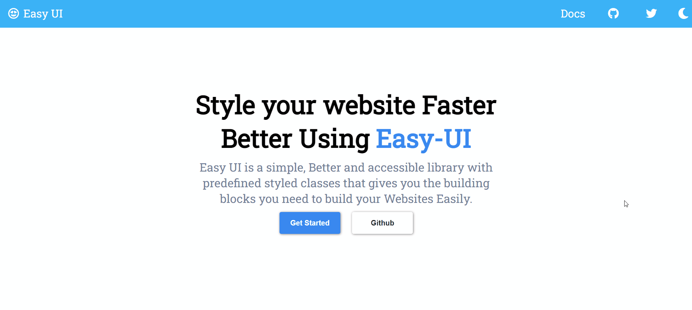

# Easy-UI Component Library

---

## Quick Start

Add below link into your html file and you are ready to use Easy-UI into your Project

```html
<link
	rel="stylesheet"
	href="https://easyui-library.netlify.app/styles/component.css"
/>
```

### The components which are avilable in Easy-UI component library .

- [Avatar](#avatar)
- [Alert](#alert)
- [Badge](#badge)
- [Button](#button)
- [Card](#card)
- [Image](#image)
- [Input](#input)
- [Text-utility](#text-utility)
- [List](#list)
- [Rating](#rating)
- [Modal](#modal)
- [snakBar](#snackBar)
- [Responsive-grid](#responsive-gird)
- [navigation](#navigation)
- [slider](#slider)

---

### Avatar

The Avatar component is used to represent a user, and displays the profile picture, initials.

You can find more detail about this on https://easyui-library.netlify.app/componets/avatar/avatar.html

- Avatar Info
- Round Avatar
- Different Sizes of Avatar
- Square Avatar

---

### Alert

Alert Provides user with the info of Action, in a way that attracts users action.

You can find detail about this on https://easyui-library.netlify.app/componets/alert/alert.html

- Simple Alert
- Success Alert
- Info Alert
- Warning Alert
- Danger Alert
- Icon Alert
- Outline Alert

---

### Badge

Badge are used to highlight an item's status such as online / offline status , display numbers. Badges are small circles, positioned either at top-right or bottom-right of the parent component.

You can find more details about this by click on https://easyui-library.netlify.app/componets/badge/badge.html

- Avatar Badges
- Icon Badges
- Badges on Different Positions

---

### Button

The Button component allows user to take action such as submitting a form, opening a dialog, canceling an action, or performing a delete operation.

You can find more details by clicking on https://easyui-library.netlify.app/componets/buttons/buttons.html

- Simple Button
- Outline Button
- Link Button
- Icon Button
- Floating Action Button

---

### Card

A card is a flexible and extensible content container and contains actions about a single subject.You can use this cards in Ecommerce website and in many other places.

You can find more details by clicking on https://easyui-library.netlify.app/componets/cards/cards.html

- Text only card
- card with Image
- card with Heading at top
- card with text-overlay
- Vertical Card
- Horizontal Card
- Card with badge
- Vertical Card with dismiss
- Card with shadow

---

### Image

self-explanatory

You can find more details by clicking here https://easyui-library.netlify.app/componets/images/images.html

- Square Image
- Round Image
- Images of Different Sizes
- Responsive Image

---

### Input

Inputs are used to get the user information and to store that data. Inputs can be used in forms during signin and in many other places.

You can find more details by clicking here https://easyui-library.netlify.app/componets/input/input.html

- Basic Input
- Different Size Inputs
- Labeled Inputs
- Error Success Inputs
- Message Inputs
- Input With Different Options
- Date and Time Input
- CheckBox Input
- Radio Input
- Textarea
- Sample Form

---

### Text-utility

Text-Utility is mainly used to style heading, paragraph of the web-page , by giving them different font-size and weight.

You can find more details by clicking here https://easyui-library.netlify.app/componets/text_utilities/textutilities

- Headings
- Text Sizes
- Text Decoration
- Text Center

---

### List

List component is used to display list items. They are composed of items containing primary and supplemental actions, which are represented by icons and text

You Can find more details here https://easyui-library.netlify.app/componets/lists/lists.html

- Normal list
- Stacked List

---

### Rating

Rating is mostly used to get review of user .

You can find more detail by clicking here https://easyui-library.netlify.app/componets/ratings/ratings.html

- E-Commerce Ratings
- Static Ratings

---

### Modal

Modal appear on screen after some operation done by user and disappear when user click on the cancel button

You can find more details by clicking here https://easyui-library.netlify.app/componets/modal/modal.html

---

### SnackBar

Snackbars provide brief messages about app processes at the bottom of the screen.

You can find more details by clicking here https://easyui-library.netlify.app/componets/snackBar/snackBar.html

---

### Responsive-Grid

Grid is mainly used to display your components we use Display:grid for grids

You can find more details by clicking here https://easyui-library.netlify.app/componets/grid/grid.html

---

### Navigation

Navigation is used to navigate in a website it is generally placed at top of the Website.

You can find more details by clicking here https://easyui-library.netlify.app/componets/navigation/navigation.html

---

### Slider

The Slider is used to allow users to make selections from a range of values.

You can find more details by clicking here https://easyui-library.netlify.app/componets/slider/slider.html

---

## 👨‍💻 Connect with me

<a href="https://twitter.com/prathmesh_20"></a>
<a href="https://www.linkedin.com/in/prathmeshjagtap/"></a>

---

## Demo


